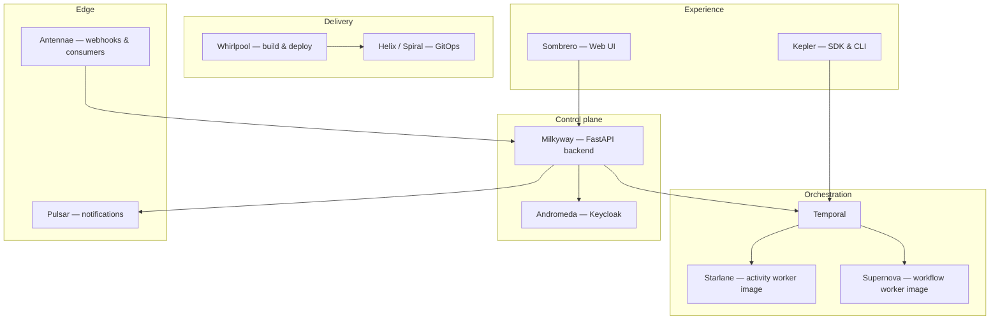

<div align="center">

# Aetherion

### Agent orchestration, durable workflows, and cloud-native delivery

**Temporal-backed automation · multi-tenant APIs · IaC & GitOps · local-to-prod parity**

<br>

[](https://www.python.org/)
[](https://fastapi.tiangolo.com/)
[](https://temporal.io/)
[](https://www.terraform.io/)
[](https://aws.amazon.com/)
[](https://kubernetes.io/)
[](https://argo-cd.readthedocs.io/)
[](https://www.docker.com/)

<br>

</div>

---

## At a glance

Aetherion is a **full-stack platform** for running AI agents and activities as **durable Temporal workflows**, with a **multi-tenant control plane**, **build/deploy automation**, **event ingress** (webhooks & consumers), and **production-grade infrastructure** on AWS (and GCP where applicable). The same concepts you use in production can be exercised end-to-end on a **single laptop** via the local stack.

---

## Architecture

High-level flow from UI and API through workflows, workers, and delivery:



---

## Repository map

| Area | Package | What it does |
|------|---------|----------------|
| **Local dev** | [`constellation`](constellation/README.md) | Docker Compose stack: Temporal, Postgres, MinIO, Phoenix, Keycloak, gateway, supporting services |
| **Backend** | [`milkyway`](milkyway/README.md) | FastAPI service: agents, activities, workflows, knowledge base, Slack/Jira/Notion, OpenTelemetry |
| **Build / deploy** | [`whirlpool`](whirlpool/README.md) | Turns bundles into images; local Docker or Kaniko on K8s; GitOps-oriented deploy hooks |
| **Workers** | [`supernova`](supernova/README.md) | Base **workflow** worker image; auto-discovers user workflows |
| | [`starlane`](starlane/README.md) | Base **activity** worker image; auto-discovers user activities |
| **Shared libs** | [`ursa`](ursa/README.md) | Common Python library: DB, storage, Temporal helpers, logging |
| | [`zenith`](zenith/README.md) | Metering / usage tracking library for billing-style metrics |
| **SDK** | [`kepler`](kepler/README.md) | Developer SDK, CLI, and docs for building on the platform |
| **Agents & tools** | [`starforge`](starforge/README.md) | Packaged agents, activities, and shared tooling metadata |
| **Ingress** | [`antennae`](antennae/README.md) | Webhooks and SQS consumers (e.g. Slack, Gmail) |
| **Notifications** | [`pulsar`](pulsar/README.md) | Multi-channel notification gateway (FastAPI, Apprise, AWS) |
| **Auth** | [`andromeda`](andromeda/README.md) | Keycloak with custom theme (wired through Constellation locally) |
| **Frontend** | [`sombrero`](sombrero/README.md) | Next.js app — primary UI (`https://app.localhost` with Constellation nginx) |
| **Infrastructure** | [`nebula`](nebula/README.md) | Terraform: EKS, RDS, API Gateway, runners, networking, observability hooks, GCP modules |
| **GitOps** | [`helix`](helix/README.md) | Non-prod Argo CD deployment artifacts |
| | [`spiral`](spiral/README.md) | Production Argo CD deployment artifacts |
| **Data** | [`flyway`](flyway/README.md) | SQL migrations for shared schemas |
| **Quality** | [`blackeye`](blackeye/README.md) | Playwright automation against live environments |
| **Automation** | [`draco`](draco/README.md) | Web scraping library (Python) |
| **Runtime** | [`phantom`](phantom/README.md) | Dynamic multi-user browser / VNC session server |
| **Platform APIs** | [`oblivion`](oblivion/README.md) | Secrets-related APIs |

<details>
<summary><strong>More components</strong> — supporting services & utilities</summary>

| Package | Notes |
|---------|--------|
| [`docs`](docs/) | Design notes and internal documentation |
| [`scripts`](scripts/) | Operational and maintenance scripts |
| `testing/` | Experiments and local test harnesses (not production paths) |

</details>

---

## Tech stack

| Layer | Choices |
|-------|---------|
| **Runtime** | Python 3.12 · Node.js 20+ (UI & tests) |
| **APIs** | FastAPI · OpenTelemetry / Phoenix tracing |
| **Workflows** | Temporal server & workers |
| **Data** | PostgreSQL · Redis · object storage (S3 / MinIO) · Neo4j + Mem0 (local stack) |
| **Identity** | Keycloak (Andromeda) |
| **Cloud** | AWS (EKS, RDS, Lambda, SQS, SNS, SES, …) · GCP modules where used |
| **Delivery** | Docker · Kubernetes · Argo CD · Terraform |

---

## Getting started (local)

The fastest path is the **Constellation** stack — it mirrors many production dependencies and exposes the UI behind local TLS.

```bash
cd constellation
# Follow: checkout → .env → creds → nginx certs → build → Keycloak bootstrap
```

See **[Constellation — Local Dev Stack](constellation/README.md)** for the full sequence (ports, Keycloak users, and gateway URLs).

**Typical flow after the stack is up**

1. Bring up services with `./build.sh` (and prerequisites from the Constellation README).
2. Open the app at **`https://app.localhost`** (per Constellation docs).
3. Point **`milkyway`**, **`whirlpool`**, or **`starforge`** development at the local Temporal and DB endpoints from their respective READMEs.

---

## Design principles

- **Durable execution** — business logic lives in Temporal workflows and activities, not fragile cron glue.
- **Multi-tenancy by default** — control-plane APIs resolve tenant context from auth and data layers.
- **Observable** — traces and metrics wired for real debugging, not afterthoughts.
- **Reproducible environments** — same building blocks locally (Compose) and remotely (Terraform + GitOps).

---

<div align="center">

<br>

**Built as a cohesive platform — services, workers, infra, and UI in one orbit.**

<br>

</div>
